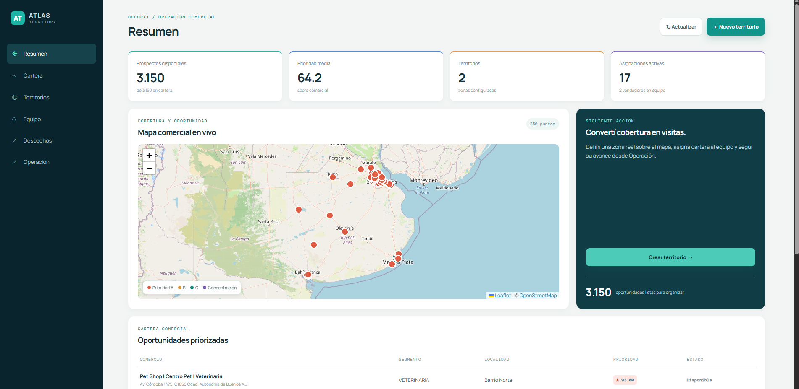
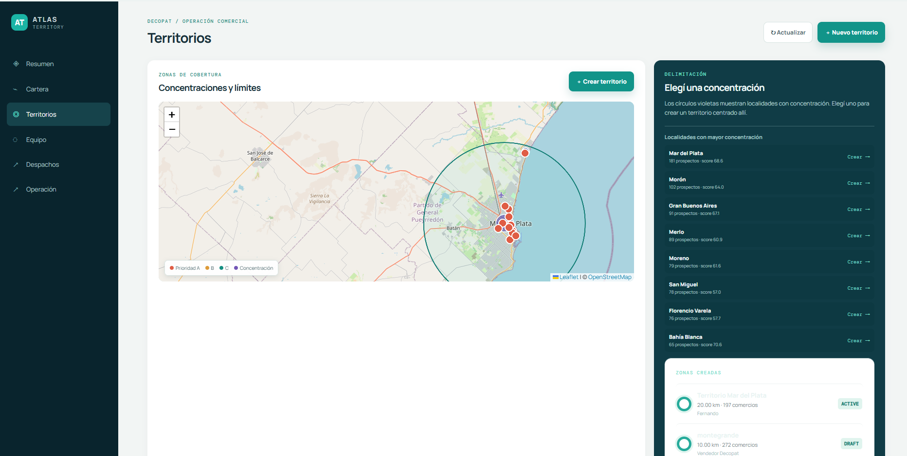
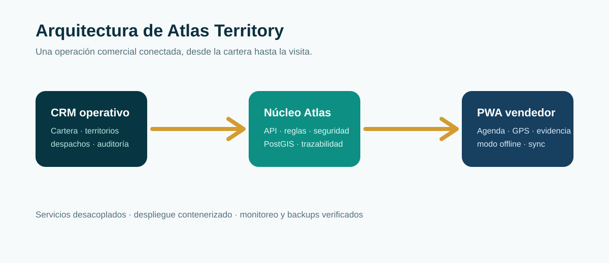

# Atlas Territory

> Plataforma de operación comercial territorial que transforma una cartera de prospectos en una agenda de campo trazable.



## El desafío

Los equipos comerciales suelen trabajar con datos dispersos, zonas poco claras y poca visibilidad sobre la ejecución en calle. Atlas Territory reúne importación, priorización geográfica, definición de territorios, despacho y seguimiento de visitas en un único flujo.

## Capacidades

- Importación desde Excel con validación de calidad, duplicados y geocodificación.
- Territorios mediante radio o polígonos sobre mapa.
- Asignación de cartera con control de capacidad del vendedor.
- Agenda móvil con modo offline, GPS, evidencia y seguimientos.
- Auditoría, acciones masivas, exportaciones y respaldo verificado.

## Flujo operativo

```text
Excel → revisión de calidad → mapa de concentración → territorio
      → responsable → despacho → agenda de vendedor → visita y seguimiento
```

## Previews

| Territorios | PWA vendedor | Demo visual |
| --- | --- | --- |
|  |  | [Abrir demo](demo/index.html) |

## Arquitectura



## Stack

TypeScript · React · Node.js · PostgreSQL · PostGIS · Docker · PWA · OpenStreetMap

## Alcance público

Este repositorio es una demostración visual y técnica de alto nivel. El producto operativo, datos, integraciones, infraestructura y configuración de seguridad no forman parte de este repositorio.

## Ejecutar la demo

Abrí `demo/index.html` en cualquier navegador. No requiere instalación, credenciales ni servicios externos.

---

**Atlas Territory** · geografía, operación comercial y ejecución en campo.
